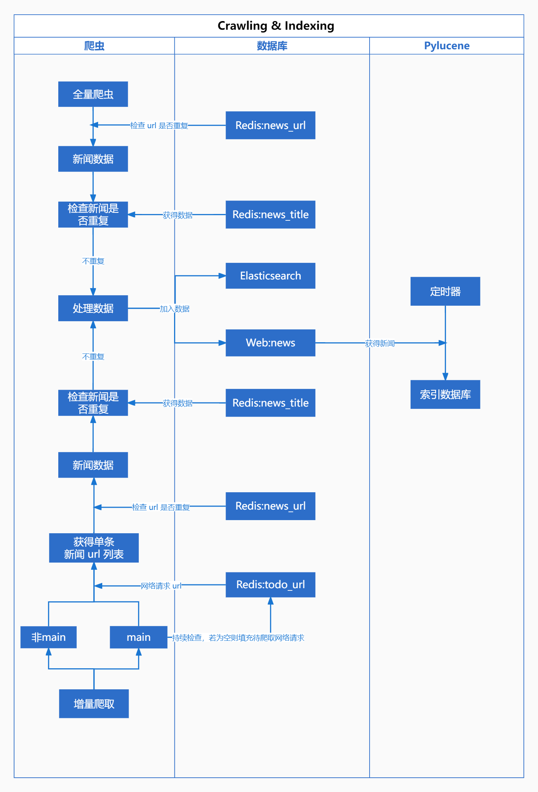
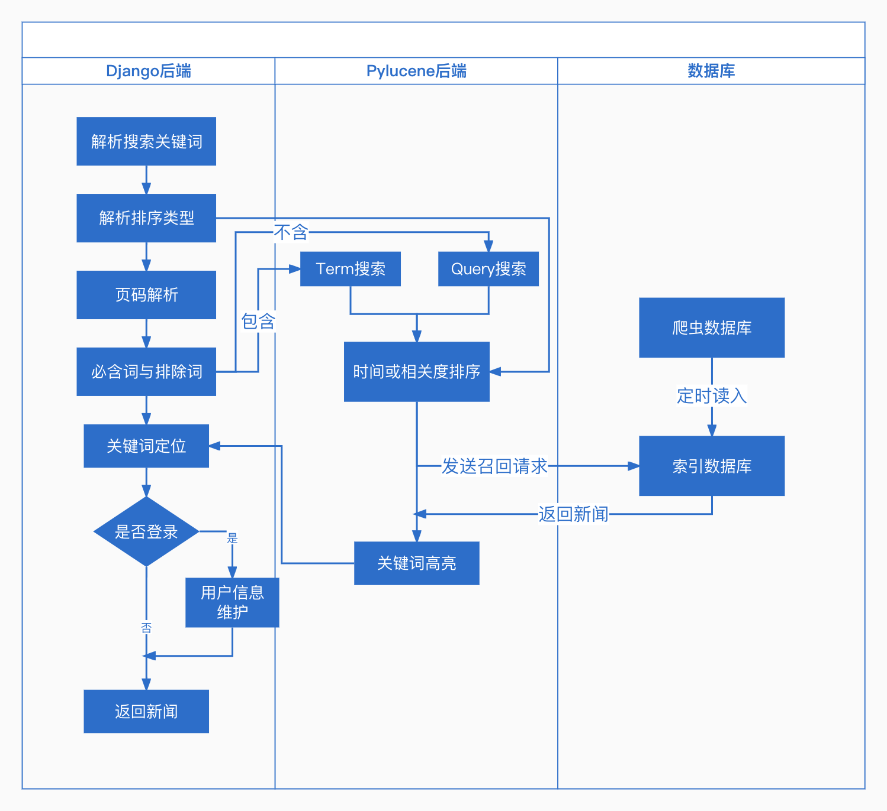
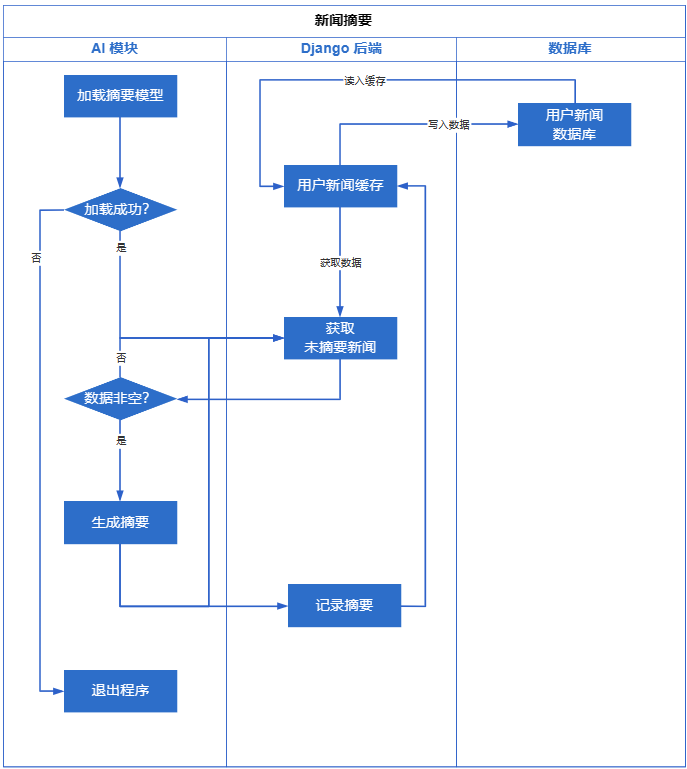

# 需求实现

## 模块分析

我们采用模块化设计，将整个系统分为【Django 后端，AI 模块，Pylucene 模块，Vue 前端，Scrapy 爬虫】五部分，并尽可能减少模块间的耦合，最终得到了如下架构：

## 功能分析

在本章节中，我们将展示各模块如何通信以满足用户需求：

### 新闻爬取相关

### 新闻展示相关

### 新闻检索相关

### 用户相关

### 新闻收藏与新闻摘要

