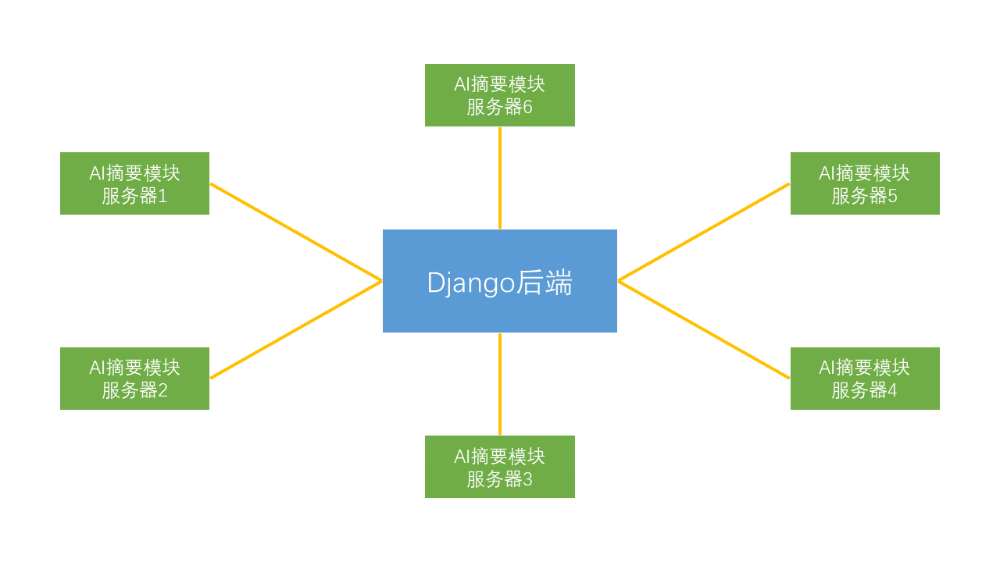

# 后端

## 架构设计




## 设计原则

1. 独立计算：AI摘要是一项计算密集型任务，不宜直接在后端进行，因此需将AI摘要模块独立放置于外部服务器运行。
2. 弹性计算：AI摘要的服务需求是弹性的，仅在高峰期需要大量计算资源。同时AI计算的成本是高昂的。因此使用模块化设计，后端可以与多个AI模块相连。通过增减与后端相连的AI模块，可以弹性改变AI算力，节约运算成本。
3. 高可用性：AI摘要的实现技术多样、迭代升级快。使用模块化设计可使AI摘要服务的变更不影响后端服务可用性。

## 功能设计

### AI摘要

#### 摘要模型
输入新闻内容`token_ids`，输出新闻摘要`token_ids`

#### 分词器
输入新闻内容字符串，输出新闻内容`token_ids`

#### 解码器
输入新闻摘要`token_ids`，输出新闻摘要字符串

### 服务器

#### 摘要发送
将新闻摘要发送至后端

#### 新闻获取
从后端获取待摘要的新闻

## 实现

### 项目结构
```
│  .pycodestyle  # pycodestyle配置文件
│  .pylintrc  # pylint配置文件
│  pytest.ini  # pytest配置文件
│  tests.py  # 单元测试
│
├─config
│      config.json  # AI服务器配置
│
└─summarize
        Pegasus.py  # 摘要模型
        server.py  # 服务器
```

### AI摘要

#### 加载模型
实现函数： `summarize.Pegasus.load_model(model_name, tokenizer_name)`

根据`model_name`，`tokenizer_name`加载`摘要模型`和`分词器（包括解码器）`。

#### 生成摘要
实现函数： `summarize.Pegasus.generate_summary(text)`

生成`text`的文本摘要。

### 服务器
实现类： `summarize.server.AIServer(adapter, server, scan_interval, model, tokenizer)`

| 参数              | 含义            |
| ----------------- | --------------- |
| `adapter`         | `通信协议`      |
| `server`          | `后端服务器`    |
| `scan_interval`   | `新闻获取间隔`  |
| `model`           | `模型名`        |
| `tokenizer`       | `分词器名`      |

#### 初始化
根据`model`和`tokenizer`执行`加载模型`

#### 运行： `self.main()`
根据`scan_interval`定期从后端`获取待摘要新闻`，`生成摘要`，并向后端`发送摘要`。

#### 获取待摘要新闻： `self.get_news()`
从后端获取多条待摘要新闻。

#### 发送摘要：`self.post_summary(summaries_list)`
将多条新闻摘要发送至后端。
