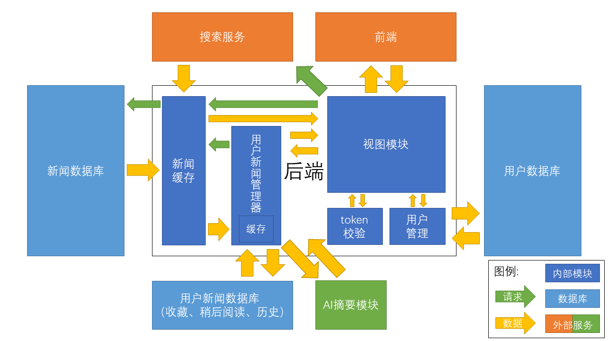

# 后端

## 架构设计



## 设计原则

1. 缓存加速：数据库中的数据量与访问速度负相关。由于`新闻数据库`数据量大（千万量级），因此需要加入缓存系统。为保证缓存命中率，将近期更新的新闻、近期与用户交互（搜索、收藏、阅读等）的新闻加入缓存。
2. 业务分离：后端与AI摘要分别是IO密集型与计算密集型任务。因此为二者建立独立服务，避免两者争抢运算资源。


## 功能设计

### 新闻缓存
1. 定时从新闻数据库获取最新新闻并缓存至内存
2. 缓存搜索内容至内存
3. 维护新闻首页展示内容
4. 向其它内部模块快速提供新闻内容
5. 启动（退出）时加载（保存）本地缓存
6. 维护缓存大小

### 用户新闻管理器
1. 记录与用户交互的新闻及交互信息
2. 缓存加速
3. 维护AI摘要内容

### `token`校验
1. 用户登陆时生成`token`（`7`天时效）
2. 用户退出登录时注销`token`
3. 维护`token`白名单
4. 校验请求中`token`是否有效

### 用户管理
1. 创建用户
2. 用户登录（登出）
3. 更新（获取）用户标签
4. 修改（获取）用户信息
5. 修改（获取）用户头像

### 视图模块
1. 根据数据库中信息，响应前端请求
2. 根据前端请求，更新数据库

## 实现

### 项目结构
```
│  .pycodestyle  # pycodestyle配置文件
│  .pylintrc  # pylint配置文件
│  pytest.ini  # pytest配置文件
│  db.sqlite3  # 默认数据库（未使用）
│  manage.py  # Django项目管理
│
├─asyNc  # 默认项目文件夹
│      asgi.py
│      settings.py  # 项目设置
│      urls.py  # 项目主路由
│      wsgi.py
│      __init__.py
│
├─certificate  # 数据库证书
│      ca-bundle.pem
│      ca.pem
│
├─config  # 后端配置文件
│      config.json  # 后端数据库配置
│      es.json  # es搜索配置
│      lucene.json  # lucene搜索配置
│
├─data  # 数据文件
│      default_avatar.base64  # 默认头像
│      news_cache.pkl  # 新闻缓存（本地存储部分）
│      news_template.pkl  # 新闻模板
│
└─main  # 后端主应用
    │  admin.py
    │  apps.py  # apps设置
    │  config.py  # 参数设置
    │  models.py  # 数据模型
    │  responses.py  # responses模板
    │  tests.py  # 单元测试
    │  tools.py  # 工具
    │  urls.py  # 应用路由
    │  views.py  # 视图
    │  __init__.py
    │
    ├─managers
    │      DBScanner.py  # 新闻缓存定时更新器
    │      NewsCache.py  # 新闻缓存管理器
    │      LocalNewsManager.py  # 用户新闻管理器
    │
    └─migrations  # 数据库模型迁移
```


### 新闻获取函数： `get_data_from_db`
实现函数：`main.tools.get_data_from_db(news_id)`

按优先顺序根据`news_id`从`新闻缓存管理器`、`用户新闻管理器`、`新闻数据库`中获取新闻并返回。

### 新闻缓存定时更新器
实现类：`main.managers.DBScanner.DBScanner(db_connection, news_cache, get_data_from_db, testing_mode=False, front_page_news_num=10, db_check_interval=8, db_news_look_back=65536, db_update_minimum_interval=8)`

| 参数                  | 含义              |
| --------------------- | ----------------- |
| `db_connection`       | `新闻数据库连接`  |
| `news_cache`          | `新闻缓存管理器`  |
| `get_data_from_db`    | `新闻获取函数`    |
| `testing_mode`        | `测试模式`        |
| `front_page_news_num` | `首页新闻数`      |
| `db_check_interval`   | `数据库扫描间隔`  |
| `db_news_look_back`   | `数据库扫描窗口`  |
| `db_update_minimum_interval`           | `缓存更新间隔下限`                |

#### 启动： `self.run()`
在子线程中启动。启动时根据`首页新闻数`调用`新闻获取函数`从`新闻数据库`中快速获取满足新闻首页展示数量的最新新闻。启动后`扫描`数据库变更。

#### 扫描： `self.check_db_update()`
根据`数据库扫描间隔`定期`获取数据库新闻数`。若`新闻数据库`中新闻数目更新，则根据`缓存更新间隔下限`判断是否更新缓存并执行。

#### 获取数据库新闻数： `self.get_db_news_num()`
从`新闻数据库`中获取数据库新闻总数。

#### 更新缓存： `self.update_cache()`
调用`新闻缓存管理器`的更新缓存方法。

#### 测试模式： `self.testing_mode=True`
根据`数据库扫描窗口`从`新闻数据库`获取新加入的新闻，并添加至`新闻缓存管理器`。

### 新闻缓存管理器
实现类：`main.managers.NewsCache.NewsCache()`

#### 添加新闻至缓存： `self.update_cache(news_list)`
将`news_list`中的新闻加入缓存，并维护缓存大小（删除旧新闻）。

#### 获取首页分类新闻： `self.get_cache(category)`
获取缓存中类别为`category`的新闻。

### 用户新闻管理器
实现类：`main.managers.LocalNewsManager.LocalNewsManager()`

管理与用户产生过交互的新闻。

#### 添加新闻至缓存： `self.add_to_cache(news)`
将`news`新闻加入缓存，并维护缓存大小（删除旧新闻）。

#### 存贮至用户新闻数据库： `self.save_one_local_news(news)`
将`news`新闻加入`用户新闻数据库`，并`添加新闻至缓存`：。

#### 从用户新闻数据库获取： `self.get_one_local_news(news_id)`
按优先顺序根据`news_id`从`缓存`和`用户新闻数据库`中获取新闻。

### `token`校验

#### `白名单`
样式：
```
TOKEN_WHITE_LIST={
    "user_id 1": ["encoded_token 1","encoded_token 2",...],
    "user_id 2": ["encoded_token 1","encoded_token 2",...],
    ...
}
```

#### 创建`token`
实现函数： `main.tools.create_token(user_name, user_id=0)`

根据`user_name`，`user_id`，`当前时间`创建`token`。

#### 解码`token`
实现函数： `main.tools.decode_token(encoded_token)`

根据`encoded_token`，解码得到`user_name`，`user_id`并返回。

#### 检验`token`过期
实现函数： `main.tools.token_expired(token)`

检查`token`是否过期。

#### 将`token`加入白名单
实现函数： `main.tools.add_token_to_white_list(encoded_token)`

将`encoded_token`加入`白名单`。

#### 检验`token`有效
实现函数： `main.tools.check_token_in_white_list(encoded_token)`

先检查`encoded_token`是否在`白名单`，之后`检验token过期`。

#### 将`token`移除
实现函数： `main.tools.del_token_from_white_list(encoded_token)`

将`encoded_token`移除`白名单`。

