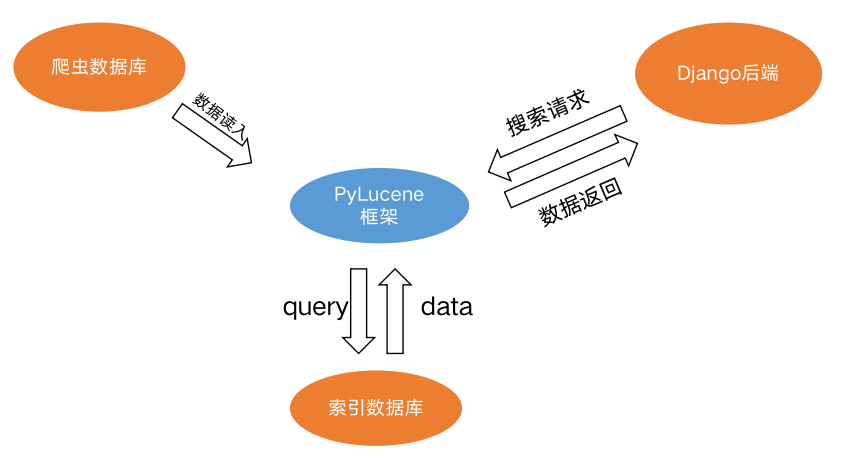

# 检索

## 架构设计

## Pylucene功能设计

### 核心

1. 多线程：多线程定时从爬虫数据库读取信息并构建索引数据库
2. 索引数据库分片：通过将索引数据库分片，实现搜索时候的多线程检索，提高搜索速度，达到千万数据量新闻秒级别响应
3. 镜像重构：在原本的Pylucene镜像中增添新的中文分词器，获得更好的分词效果
4. 关键词高亮：利用Pylucene的原生高亮功能对索引数据库中出现关键词的片段进行高亮处理，减小Django后端的压力，并且也能提高响应速度。
4. 模块分离：遵从模块分离原则，在搜索部分引入TinyRpc通信模块，Django后端与Pylucene通过HTTP协议进行数据通信
4. 多样检索方式：设计了基本分词检索、必选词与排除词检索等检索接口，为用户提供多样的搜索服务。

### 数据库构建

1. 定时从爬虫数据库进行数据的读取，每1s进行一次新闻检索，是否有新的新闻写入。
2. 分片构建索引数据库，根据新闻的数据库id写入对应的分片索引数据库中，同时也能实现多线程写入，提高读取速度，目前的速度大约是600w/天，远大于爬虫爬取速度，能够满足实际需求。

### 索引服务

1. 分片索引数据库多线程索引，提高搜索速度，结果合并的时候根据Pylucene的关键词相关度打分进行排序，返回最相关的新闻。

2. 搜索按照时间排序：为了在保证相关度的同时对返回新闻进行时间的排序，我们对索引数据库中的返回数据进行了一个阈值的筛选，相关度评分大于该值的新闻进行排序，并且返回排序结果。

2. 关键词与排除词搜索：利用Pylucene的`多域检索`和`Term检索`支持多关键词和排除词搜索需求。

## 实现

### Read相关：

对每一条写入索引数据库的新闻，记录如下条目：

- news_url: 新闻网址
- category: 新闻类别
- media: 新闻媒体
- tags: 新闻标签
- title: 新闻标题
- content: 新闻正文
- first_img_url: 头图
- pub_time: 发布时间
- id：数据库id

关键函数：

-  `def check_db_status`：用来检查数据库的连接状态
-  `def get_document`：生成索引数据类对象
-  `def read_from_db`：用来从爬虫数据库读取信息并写入索引数据库
  - 传入：起始id与终止id

- `def read_thread`：用于多线程的读取管理

### Search相关

核心实现类：`class SearchEngine()`

核心功能：提供搜索的相关接口

关键函数：

-  `def search_keywords`：
  - 传入：搜索的关键词、必须包含的关键词列表、排除词列表、分页页码
  - 返回：相关页码高亮后的十条结果组成的列表
- `def search_news`:
  - 传入：搜索的关键词、分页页码
  - 返回：相关页码高亮后的十条结果组成的列表

### Thread相关

核心实现类：`class MyThread()`

核心功能：用来维护多线程的搜索功能，并且记录返回结果

关键函数：

- `def run`：多线程函数的运行管理
- `def get_result`：带返回值的多线程函数的结果记录

## 搜索后端

### 搜索相关：

核心功能：支持基本的搜索功能

关键函数：

- `keyword_search`:实现最基本的搜索功能，从前端请求中解析出相关的关键词、页码、必含词排除词参数进行搜索处理
- `get_location`：根据Pylucene对于搜索关键词的高亮标记进行位置定位，方便前端的渲染
- `check_contain`：由于Pylucene相关的分词器有时候无法满足需求，需要对返回结果进行额外的必含词与排除词检查

### 用户功能相关：

核心功能：满足搜索中相关的用户需求记录

关键函数：

- `update_tags`:根据jieba分词器以及搜索的返回结果，将前三条搜索结果的tags存入用户的搜索偏好中
- `personalize`:根据用户的搜索偏好进行用户的个性化推荐，返回相关的新闻。

### 搜索建议：

> 通过Elasticsearch进行搜索建议的返回

核心类：`class ElasticSearch`

核心函数：`suggest`：传入已经写入的关键词，返回相信的搜索补全推荐结果。