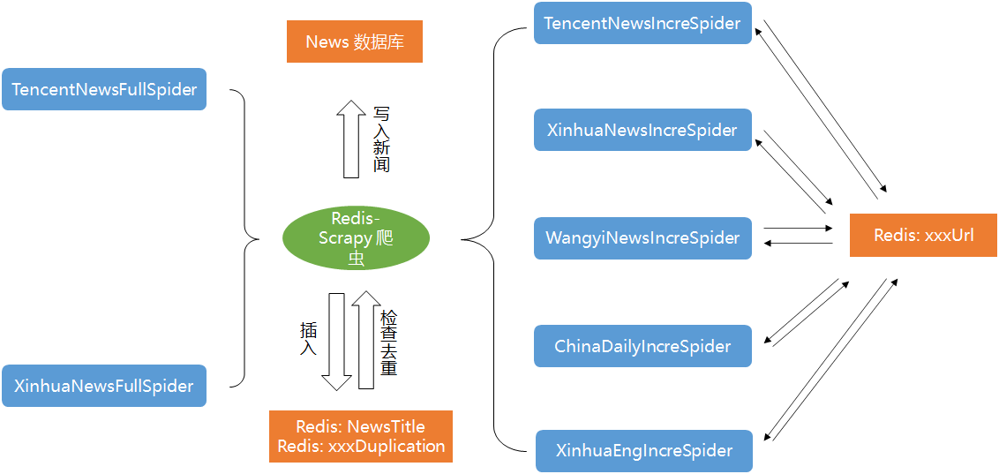

# 爬虫

## 架构设计

## 功能设计

### 核心

1. 多线程：对每个进程使用 16 个线程同时爬取&处理数据。
2. 分布式：利用 redis 实现了分布式爬虫，在计算资源支持的情况下可实现多个进程同时运行。
3. 异步：在等待网络请求时执行其他计算操作。
4. 两级去重：利用 redis set 数据结构，首先对 url 进行去重，若 url 相同则不会发起网络请求；之后以新闻标题前 10 个字为标准进行去重。

### 全量爬取

1. 实现了对【腾讯新闻，新华网】的全量爬取。
2. 爬取速度 150w/天

### 增量爬取

1. 实现了对【腾讯新闻，网易新闻，新华网，China Daily，新华网英文版】五个新闻网站的增量爬取，其中包含 43 个网页，共计 65 个网络请求。
2. 理论上能够对网页新闻实现 1s 级的响应，即爬取网页中出现某条新闻后，能够在 1s 内将新闻加入数据库中。

## 实现

### item

实现类：`class NewsCrawlerItem(scrapy.Item)`

对每一条新闻，记录如下条目：

- news_url: 新闻网址
- category: 新闻类别
- media: 新闻媒体
- tags: 新闻标签
- title: 新闻标题
- description: 新闻摘要
- content: 新闻正文
- first_img_url: 头图
- pub_time: 发布时间

### pipeline

核心实现类：`class SQLPipeline()`

对每一个爬取到的 item，我们设计了统一的流水线进行处理，该流水线完成如下功能：

1. 利用事先写好的去重类 `class Deduplicate()` 进行去重，若新闻重复则忽略该条新闻。
2. 将新闻写入 PostgreSQL 新闻数据库中。
3. 将新闻写入 Elasticsearch 索引数据库中。

### 全量爬虫

> 可使用 `scrapy crawlall` 指令通识启动所有全量爬虫

#### 腾讯新闻

实现类：`class TencentNewsAllQuantitySpider(scrapy.Spider)`

实现逻辑：

- 腾讯新闻的绝大多数新闻网址符合正则表达式 `r'https://news.qq.com/rain/a/[0-9]{8}[VA]0[0-9A-Z]{4}00'`，其中 [VA] 前的 8 个数字表示发布日期，因此采用枚举法对符合改正则表达式的所有 url 进行爬取。
- 每个进程负责枚举一天的新闻，所有进程共同负责所有在待爬取 url 池中新闻条目的爬取。

使用方式：`scrapy crawl TencentNewsAllQuantity [-a begin_date='20220101'] [-a end_data='20221031'] [-a data_table='news']`

#### 新华网

实现类: `class XinhuaNewsAllQuantitySpider(scrapy.Spider)`

实现逻辑：

- 与腾讯新闻类似，绝大多数新闻网址符合正则表达式 `r'http://www.news.cn/.*?/\d{4}-\d{2}/\d{2}/c_\d{10}'`，其中 `.*?` 代表类别，`\d{4}-\d{2}/\d{2}` 代表日期。
- 每个进程负责枚举一天的新闻，所有进程共同负责所有在待爬取 url 池中新闻条目的爬取。

使用方式：`scrapy crawl XinhuaNewsAllQuantity [-a begin_date='20220101'] [-a end_data='20221031'] [-a data_table='news']`

### 增量爬虫

所有增量爬虫实现逻辑基本相同，在此统一进行说明：

- 在 web_news_config.json 中写入待监视网络请求。
- 每类增量爬虫在开启时可附加 main 属性，需额外创建 `IncrementTimer` 类，负责监视 redis 内对应数据库中的网络请求是否为空，若为空则重新向 redis 数据库中加入相应的网络请求 url。
    - redis 数据库命名：若爬取新闻站点为 Tencent，则相应的数据库命名为 `TencentNewsIncre:start_urls`，其他增量爬虫同理。
    - 利用在构建增量爬虫类时额外开启一个线程来监视 redis 数据库是否为空。
- 从待爬取网络请求链接中获得新闻条目列表，进而爬取新闻条目内容。
- 同一类别的所有增量爬虫共同负责所有在待爬取 url 池中新闻条目的爬取。

#### 腾讯新闻

实现类：`class TencentNewsIncreSpider(RedisSpider)`

使用方式：`scrapy crawl TencentNewsIncre [-a data_table='news'] [-a attribution='main']`

#### 新华网

实现类：`class XinhuaNewsIncreSpider(RedisSpider)`

使用方式：`scrapy crawl XinhuaNewsIncre [-a data_table='news'] [-a attribution='main']`

#### 网易新闻

实现类：`class WangyiNewsIncreSpider(RedisSpider)`

使用方式：`scrapy crawl WangyiNewsIncre [-a data_table='news'] [-a attribution='main']`

#### China Daily

实现类：`class ChinaDailyNewsIncreSpider(RedisSpider)`

使用方式：`scrapy crawl ChinaDailyNewsIncre [-a data_table='news'] [-a attribution='main']`

#### 新华网英文版

实现类：`class XinhuaEngNewsIncreSpider(RedisSpider)`

使用方式：`scrapy crawl XinhuaEngNewsIncre [-a data_table='news'] [-a attribution='main']`
