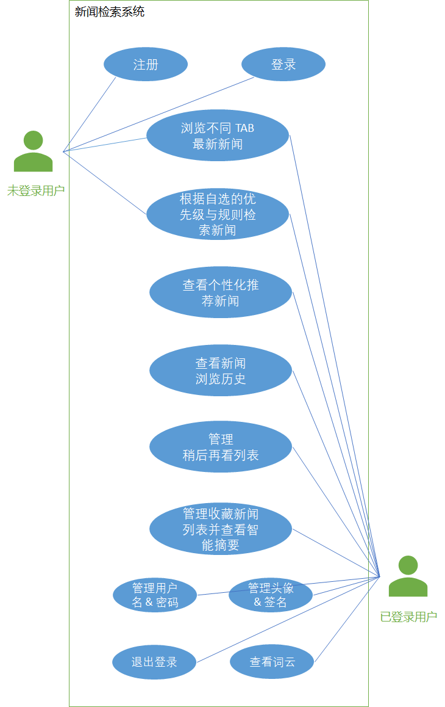
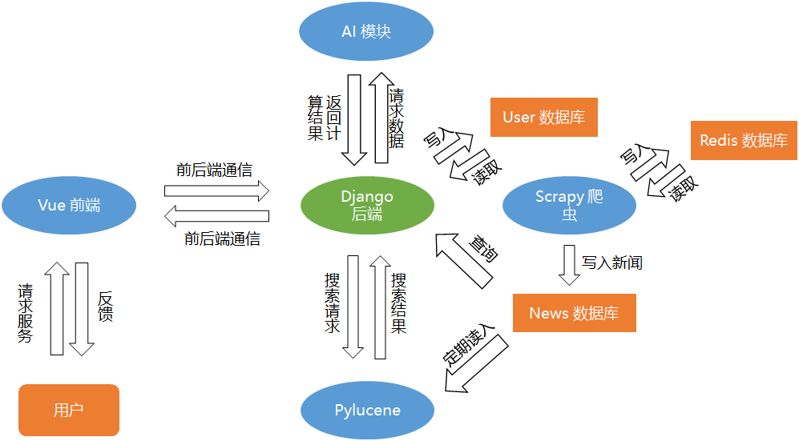
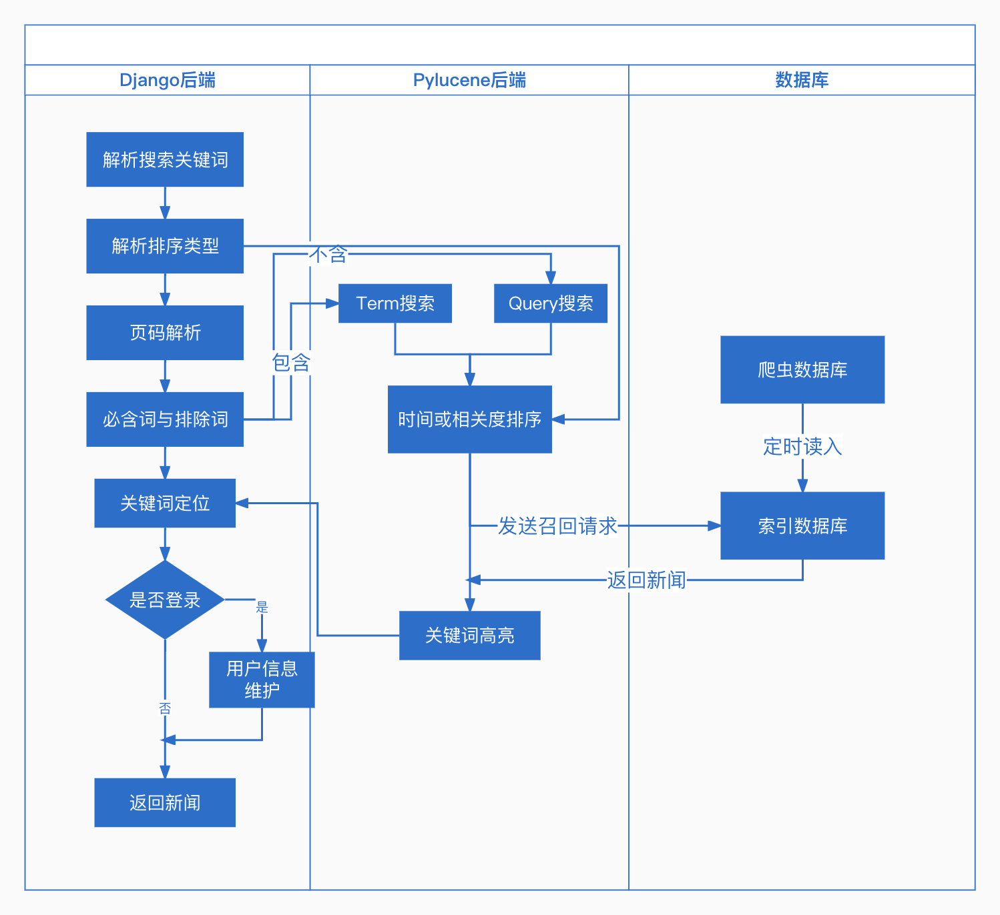
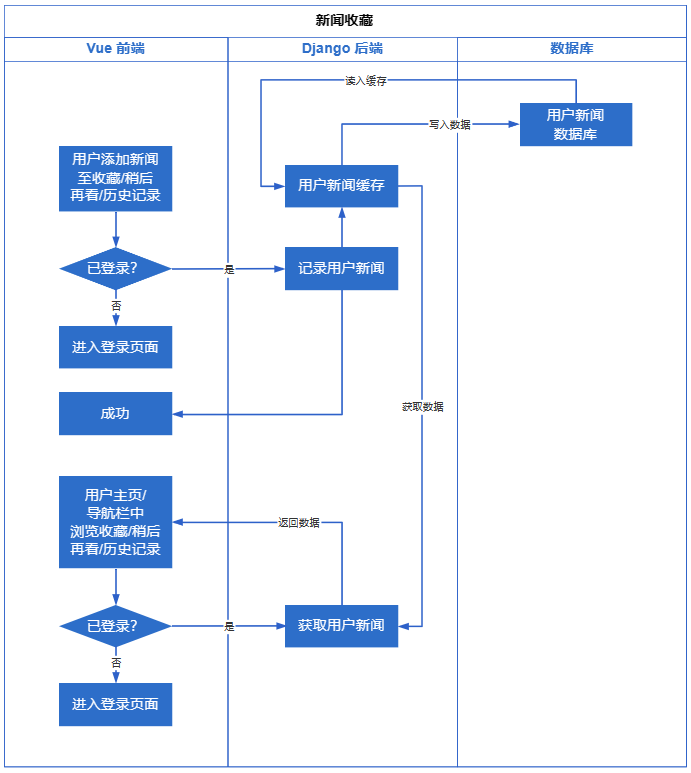
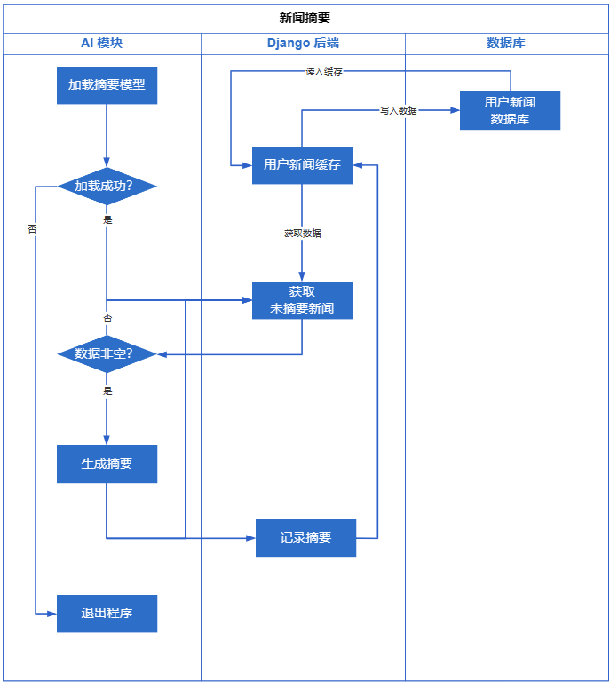

# 需求及分析

## 用户需求分析

用户端：
- 提供新闻主页展示功能
  - 可以选择不同栏目，查看不同栏目的最新新闻
- 提供新闻检索功能
  - 可以选择按照相关度排序或按照时间排序
  - 可以增添搜索项必须词与排除词
- 点击相应新闻后可以跳转至对应的新闻条目进行展示
- 用户可以管理个人信息
  - 用户名，密码
  - 头像，个性签名
- 用户可以根据最近浏览的新闻查看个人喜好（以词云展示）
- 用户可以查看系统推荐的个性化新闻
- 用户可以查看浏览历史
- 用户可以将希望查看的新闻添加至稍后再看列表
- 用户可以收藏新闻
  - 系统可以为用户收藏的新闻进行智能摘要

## 用例分析

为了更好的展示用户需求，我们可以从用户角度画出如下用例图：

## 按模块划分结构

我们采用模块化设计，将整个系统分为【Django 后端，AI 模块，Pylucene 模块，Vue 前端，Scrapy 爬虫】五部分，并尽可能减少模块间的耦合，最终得到了如下架构：

## 按功能划分结构

在本章节中，我们将展示各模块如何通信以满足用户需求：

### 新闻爬取相关

### 新闻展示相关

### 新闻检索相关

### 用户相关

### 新闻收藏于新闻摘要

