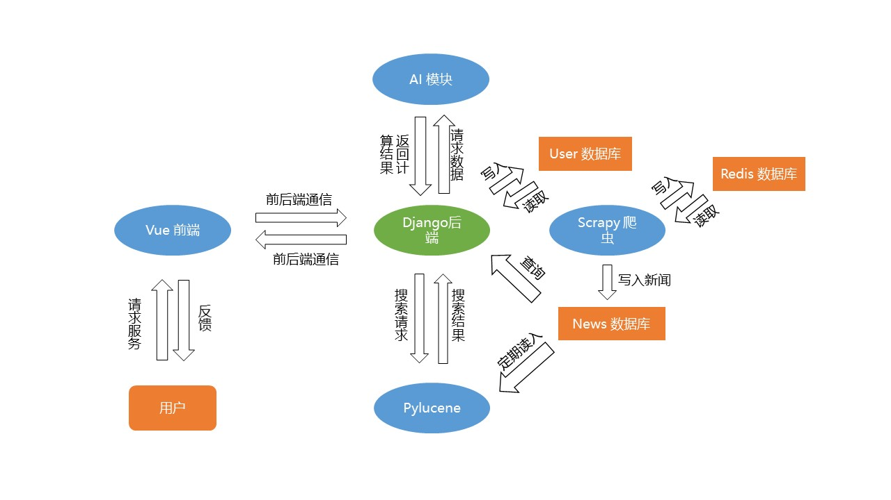
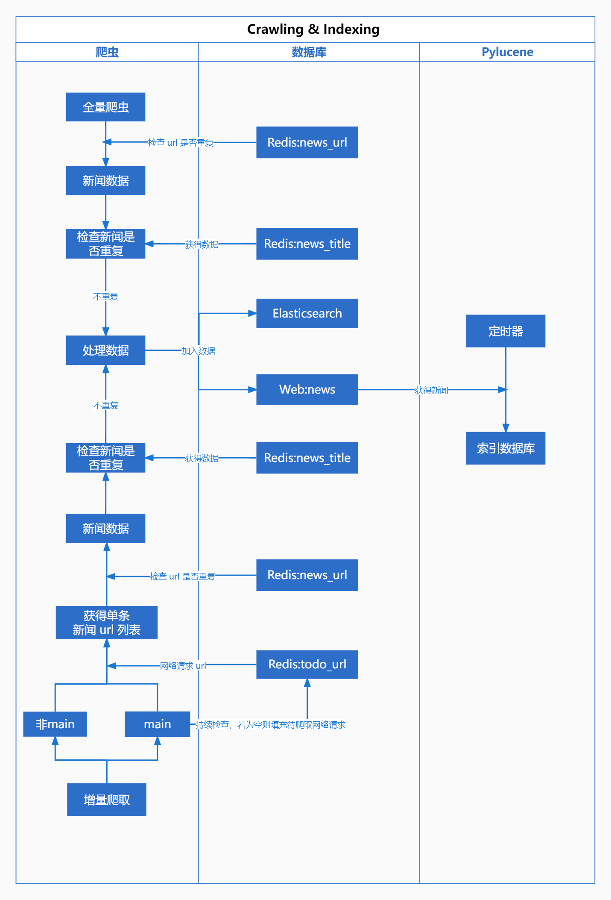

# 系统架构

## 按模块划分

我们采用模块化设计，将整个系统分为 【Django 后端, AI 模块, Pylucene 模块, Vue 前端, Scrapy 爬虫】 五部分，并尽可能减少模块间的耦合，最终得到了如下架构：

## 按功能划分

在本章节中，我们将展示在不同功能中各模块如何实现通信：

### 新闻爬取相关

### 新闻展示相关

TODO:
负责人：*wbw & sxx
1. 主页新闻展示：Vue 和 Django 交互 & Django 缓存
2. 个性化新闻展示：Vue & Django & Pylucene（应包含用户登录检查）

### 新闻检索相关

TODO：
责任负责人：*szz
1. Vue 和 Django/Pylucene 交互
2. ES 搜索建议
3. Pylucene 检索逻辑

### 用户相关

TODO：
责任负责人：*wbw
1. 注册，登录，修改信息：Vue & Django
2. 用户点击新闻后 tags 变化

### 其他

TODO：
责任负责人：*sxx & wbw
1. 收藏，稍后再看，历史：Vue & Django
2. AI 智能摘要
